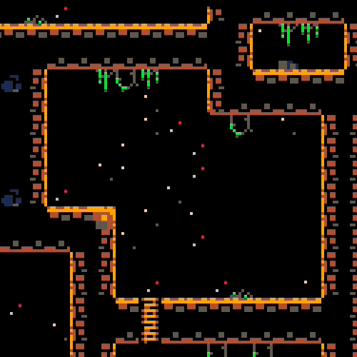
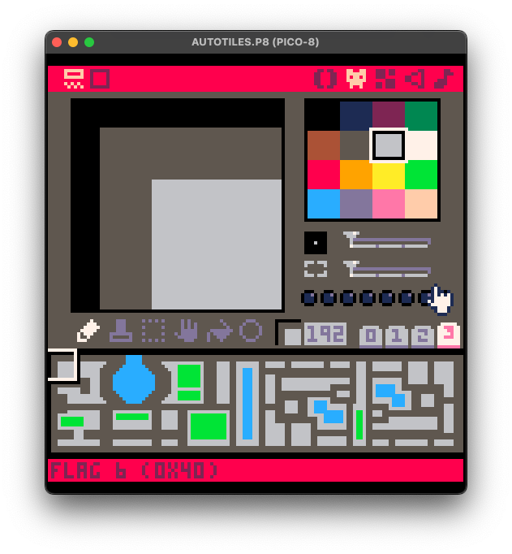
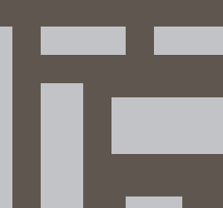
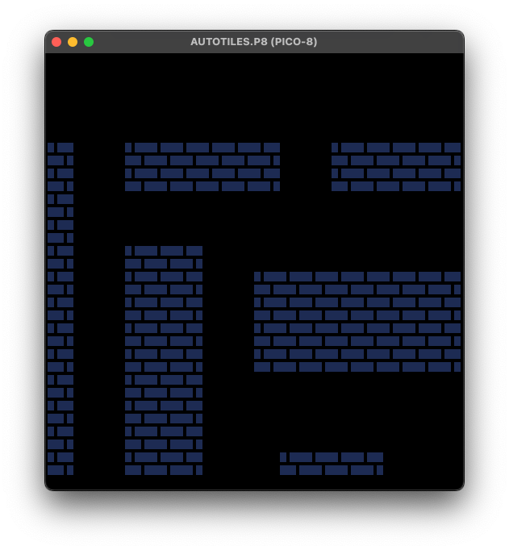
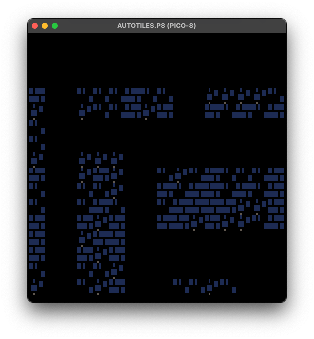
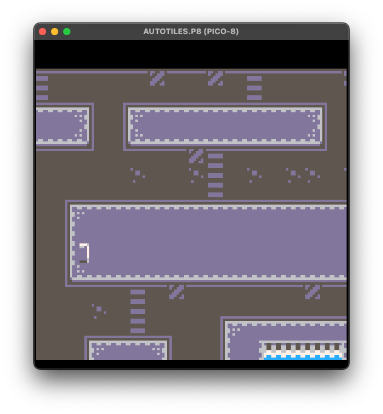

# Autotiles for Pico-8

This repository contains an autotiles generator for Pico-8. It is a simple tool that allows you to create autotiles for your Pico-8 games in a declarative way.



## Features

- Easy to use, very similar to LDtk autotiles but in a programmatic way
- Can handle single sprites and groups of sprites
- Can handle multiple groups of rules
- Can handle matrix patterns up to 5x5
- Pretty fast
- Pretty small

## How to use

You can find three examples in the codebase, where the map is hardcoded in the sprite section. This is handy but the idea is to programmatically generate the map as a 2D array where the numeric values represent the tile layer. 




Ideally a table like this, where 1 could be a wall, 0 could be an empty space, and so on.

```lua

local map = {
    {1, 1, 1, 1, 1, 1, 1, 1, 1, 1},
    {1, 0, 0, 0, 0, 0, 0, 0, 0, 1},
    {1, 0, 0, 0, 0, 0, 0, 0, 0, 1},
    {1, 0, 0, 0, 0, 0, 0, 0, 0, 1},
    {1, 0, 0, 0, 0, 0, 0, 0, 0, 1},
    {1, 0, 0, 0, 0, 0, 0, 0, 0, 1},
    {1, 0, 0, 0, 0, 0, 0, 0, 0, 1},
    {1, 0, 0, 0, 0, 0, 0, 0, 0, 1},
    {1, 0, 0, 0, 0, 0, 0, 0, 0, 1},
    {1, 1, 1, 1, 1, 1, 1, 1, 1, 1},
}

```

And a set of group of rules that define how the autotile should be generated based on the map values.

```lua
dungeonRules = {
  -- walls & pathways
  {
    -- random tree on internal pathway
    {
      sprites = { 164 },
      pattern = {
        5
      }
    },
  ...
    -- grass
  {
    {
      sprites = { 172 },
      stopOnMatch = true,
      pattern = {
        6
      }
    }
  }

```

A rule can be as easy as:

```lua
{
  -- walls
  sprites = { 3 },
  pattern = {
    5
  }
}
```

Where the sprites are the sprites that will be used to generate the autotile, and the pattern is a matrix that represents the map values that will be used to generate the autotile, where the center of the matrix is the current tile being processed.

In this case, the pattern is a 1x1 matrix that represents a wall. We are saying that if the map value is 5, then we should use the sprite 3 as tile. Whenever the pattern is matched, the autotile will be generated.

⚠️ The order of the rules is important, the first rule that matches the pattern from top to bottom will be used.





## Rule properties

`sprites` can be a single sprite or a group of sprites. If it is a group of sprites, the autotile will randomly choose one of the sprites in the group.

`pattern` is a matrix that represents the map values that will be used to generate the autotile, where the center of the matrix is the current tile being processed. The matrix can be up to 5x5. Use `'All'` to match any value.

```lua
{
  -- random walls
  sprites = { 3, 4, 5 },
  pattern = {
    5
  }
}
```



`chance` is a number between 0 and 1 that defines the probability of the rule being applied.

```lua
{
  {
    sprites = { 3 },
    pattern = {
      n
    }
  },
  {
    sprites = { 1, 2, 4, 5, 6 },
    chance = 0.2,
    pattern = {
      n
    }
  },
}
```

`stopOnMatch` is a boolean that defines if the rule should stop processing the other rules if it matches the pattnern. If it is true, the rule will stop processing, if it is false, the rule will continue processing the next one.

```lua
{
  {
    sprites = { 3 },
    pattern = {
      5
    }
  },
  {
    sprites = { 1, 2, 4, 5, 6 },
    stopOnMatch = true,
    pattern = {
      5
    }
  },
}
```

`block` is a 2D table that defines the pattern that will be used to generate the autotile. It is useful when you want to create a block of tiles that should be generated together, like a tree or a house or in this case a crosswalk. You can use it in combination with the `offsetY` and `offsetX` properties to define the offset of the block from its center. You can't use the `sprites` property with the `block` property.

```lua
-- street 3x vertical crosswalk
{
  block = {
    { 69 },
    { 85 },
    { 101 }
  },
  offsetY = -1,
  chance = 0.2,
  stopOnMatch = true,
  pattern = {
    a, -s, -s, -s, a,
    s, s, s, s, s,
    s, s, s, s, s,
    s, s, s, s, s,
    a, -s, -s, -s, a
  }
},
```



## License

This project is licensed under the MIT License. See the [LICENSE](LICENSE) file for details.

## Acknowledgments

- [LDtk](https://ldtk.io/) for the inspiration
- [Kenney](https://kenney.nl/assets/micro-roguelike) for the assets
- [Adam Saltsman](https://adamatomic.itch.io/cavernas) for the assets

